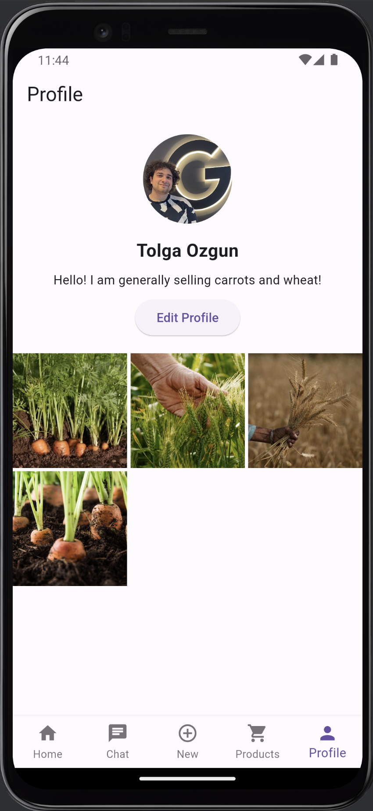

# NativeCo
In today's global food system, a significant disconnect exists between local producers of native seeds and their potential market, including restaurants and urban consumers. This disconnection leads to multiple challenges: an alarming increase in food waste, a decline in biodiversity due to the underutilization of native seeds, and a missed opportunity for promoting sustainable agriculture practices. Furthermore, the lack of an efficient platform for direct trade between local producers and buyers exacerbates these issues, contributing to unnecessary environmental degradation and impacting public health negatively. The extinction of native seeds not only affects indigenous communities and soil health but also undermines global efforts to achieve sustainability and resilience in food systems. The absence of a seamless digital marketplace hinders the preservation of biodiversity, efficient trade, and the education of communities on sustainable practices. NativeCo aims to address these critical issues by creating a digital solution that connects local producers directly with restaurants and consumers, promoting the utilization of native seeds, reducing food waste, and supporting sustainable agriculture, thereby contributing significantly to the United Nations' Sustainable Development Goals related to sustainable cities and communities, responsible consumption, life on land, and good health and well-being.

At NativeCo, our commitment to creating a sustainable, equitable world is defined in the United Nations' Sustainable Development Goals (SDGs) 3, 11, 12 and 15, specifically targeting sustainable cities and communities, responsible consumption, life on land, and good health and well-being. Our targets, 3.8, 11.4, 12.3 and 15.5 drive our mission to bridge the gap between local producers and markets, addressing the critical issues of food waste, loss of biodiversity, and public health. Our choice of these goals and targets was inspired by our observation of the lack of communication between local food production and consumer access, leading to unnecessary waste and the endangering of native seeds—a situation that not only threatens indigenous practices and soil health but also undermines the potential for urban areas to benefit from fresh, sustainable produce.

In response, NativeCo leverages innovative technology to foster a digital marketplace that encourages direct engagement between producers and restaurants. This approach not only aims to minimize food waste but also supports sustainable agriculture practices. By integrating Gemini, we further enhance the efficiency of trade and educate our users on sustainable practices, making our platform a pivotal tool for achieving our targeted SDGs. Through NativeCo, we aspire to cultivate a more sustainable, healthy, and equitable world, showcasing the power of technology in solving critical environmental and public health challenges.

Join us in strengthening the future of food sustainability with NativeCo.

Our main product is our Flutter application. In the near future, we will be releasing our Android, iOS and macOS applications to app stores!

## Table of Contents

- [About NativeCo](#about-nativeco)
- [Google Technologies Used](#google-technologies-used)
- [Features](#features)
- [Screenshots](#screenshots)
- [Installation](#installation)
- [Usage](#usage)
- [Contributing](#contributing)
- [License](#license)
- [Authors](#authors)
- [Contact Us](#contact-us)


## About NativeCo

NativeCo is more than just a marketplace; it is a movement towards a sustainable, healthy, and equitable world. By leveraging cutting-edge technology and a commitment to the United Nations' Sustainable Development Goals, we aim to address critical challenges such as food waste, loss of biodiversity, and environmental degradation. Our platform is designed to educate, engage, and empower all stakeholders in the food supply chain, from local farmers to urban consumers, in the pursuit of a better future for our planet.

## Google Technologies Used

- Gemini
  - Gemini 1.0 Pro
  - Gemini 1.0 Pro Vision
  - Gemini AI Studio
- Firebase
  - Firebase Cloud Messaging
  - Firebase Storage
  - Firebase Crashlytics
  - Firebase Analytics
- Flutter
- Google Maps API

## Features

With NativeCo, our goal is to revolutionize the connection between local producers and restaurants, enhancing the preservation and utilization of native seeds through a streamlined digital marketplace. Here are some of the key features that make NativeCo an indispensable tool:

- **Direct Connection Between Producers and Restaurants:** Facilitates a direct line of communication and trade between local producers and restaurant owners, reducing the middleman's role and fostering a closer community bond.
- **Surplus Produce Documentation:** Encourages producers to list surplus produce, minimizing food waste and promoting responsible consumption.
- **Educational Tools:** Utilizes Gemini, an advanced chatbot, to offer insights into sustainable farming practices, helping producers and buyers understand the value of native seeds and sustainable agriculture.
- **Comprehensive Platform:** Offers a full suite of features for managing the trade of goods, from listing products to chatting with potential buyers, all within an intuitive user interface.
- **Sustainable Agriculture Advocacy:** Aims to reduce environmental degradation by supporting the cultivation and trade of native seeds, contributing to the health of the land and its people.
- **Technological Innovation:** Built with Flutter for cross-platform compatibility (iOS, Android, macOS, Linux, and web deployment), ensuring a wide reach and seamless user experience. Incorporates Firebase for authentication, data storage, error logging, and security, along with Google Analytics for comprehensive user insights.


## Screenshots

| Welcome Screen | Register Screen | Login Screen | Forgot Password Screen |
| -------------- | --------------- | ------------ | ---------------------- |
|  |  |  |  |
| Dashboard Screen | Chats Screen | Add Product Screen | Products Screen |
|  |  |  |  |
| Product Screen | Gemini Screen | Conversation Screen | Profile Screen |
|  |  |  |  |


## Installation

To get started with the project, please follow these steps:

1. Clone the repository:

   git clone https://github.com/tolgaozgun/nativeco.git

2. Install Flutter through the [official guide](https://docs.flutter.dev/get-started/install). Also install an emulator through the guide if you aren't planning to use on a physical device.

3. Install the dependencies:

```
   cd frontend
   flutter pub get
```

4. Add Google Maps API Key

   Navigate to: frontend\android\app\src\main\AndroidManifest.xml. Change API_KEY_HERE with your API key from Maps SDK for Android.

```
        <meta-data android:name="com.google.android.geo.API_KEY"
               android:value="API_KEY_HERE"/>

```

5. Follow the [official Flutter run instructions]() to run either on an emulator or a physical device. 
Or you can build the project on following architectures:

- [Android](https://docs.flutter.dev/deployment/android)
- [iOS](https://docs.flutter.dev/deployment/ios)

## Usage

To use the application, follow these steps:

1. Install the application on your Android or iOS device.
2. Open the application and create an account.
3. Log in to the application and start using it.

## Contributing

As this is a Google Solution Challenge project, we do not allow third-party contributions at this time.

## License

This project is licensed under the MIT License.

## Authors

- Berra Yüce [📧](mailto:berrayuce@gmail.com)[🌐]()[]()
- Tolga Özgün [📧](mailto:tolgaozgunn@gmail.com)[🌐](https://tolgaozgun.com)[](https://github.com/tolgaozgun)

## Contact Us

Feel free to contact us via our emails listed above.
